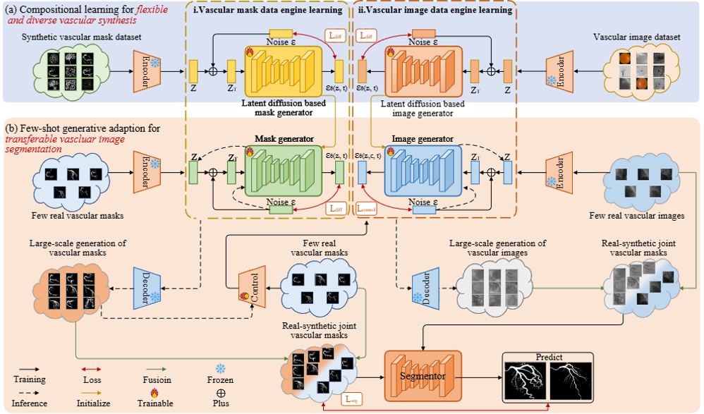

 # 📢 About This Repository
In this study, we propose UniVG, a novel generative foundation model for universal few-shot vascular image segmentation based on compositional learning and few-shot generative adaptation. By decomposing and recombining vascular structures with diverse backgrounds, our framework can synthesize highly realistic and diverse vessel images using minimal training data. UniVG has been systematically validated across 11 vascular datasets spanning five different modalities. Experimental results demonstrate its superior performance over existing methods in few-shot scenarios (using as few as five annotated images), confirming the model's excellent generalization capability and cross-domain adaptability.

---


We have established this repository to support the **reproducibility** of our work:  
**"Generative Data-engine Foundation Model for Universal Few-shot 2D Vascular Image Segmentation"**

We are committed to releasing the complete codebase incrementally following manuscript acceptance.

---
# 🎯 Currently Available

## Dataset
The UniVG-58K dataset presented in this paper comprises both pre-training data and downstream task data, which can be accessed at https://huggingface.co/datasets/xinaloha/UniVG.

## Components

| Component | Status | Release Date |
|-----------|--------|--------------|
| Spatial Colonization Algorithm (SCA) for vascular structure synthesis | ✅ **Available** | **2024.12.12** |
| Pre-trained Foundation Model & Training Code | ✅ **Available** | **2025.01.11** |
| Downstream Modality Fine-tuning Code | 📦 Coming Soon | **2025.01.30** |

---

# 🚀 Quick Start

## 1. Spatial Colonization Algorithm (SCA)

### Installation
```bash
# Clone the repository
git clone https://github.com/XinAloha/UniVG.git
cd UniVG/R-SCA

# Install dependencies
pip install numpy opencv-python Pillow matplotlib scipy shapely PyYAML tqdm
```

### Usage
Generate synthetic vascular structures:
```bash
python Main.py --input-dir ./RealCoronaryArteryMask --output-dir ./output --modality CoronaryArtery
```

---

## 2. Pre-trained Foundation Model

### Installation
```bash
cd UniVG/pretrainedModel

# Install dependencies
pip install torch torchvision pytorch-lightning albumentations opencv-python einops
```

### Training Pipeline

#### Step 1: Pre-train Latent Diffusion Model (LDM)

First, pre-train the LDM on your vascular image dataset to learn domain-specific features:

```bash
python train_ldm.py \
    --resume_path /path/to/sd-v1-5.ckpt \
    --data_path /path/to/vascular/images \
    --batch_size 2 \
    --learning_rate 1e-4 \
    --max_epochs 100 \
    --checkpoint_dir ./ldm_checkpoints/
```

**Dataset structure for LDM:**
```
vascular_images/
├── image_001.png
├── image_002.png
└── ...
```

#### Step 2: Train ControlNet

After pre-training the LDM, use it to initialize ControlNet for conditional generation:

**Train from pretrained LDM weights:**
```bash
python train_controlnet.py \
    --pretrained ./ldm_checkpoints/ldm-epoch=100.ckpt \
    --data_path /path/to/paired/dataset \
    --batch_size 2 \
    --max_epochs 2000
```


### Inference

Generate vascular images from condition inputs:
```bash
python inference_controlnet.py \
    --checkpoint /path/to/trained/model.ckpt \
    --input_path /path/to/input/masks \
    --output_path /path/to/output/images \
    --ddim_steps 20
```

### Dataset Structure

**For LDM pre-training (unconditional generation):**
```
vascular_images/
├── image_001.png
├── image_002.png
├── image_003.png
└── ...
```

**For ControlNet training (conditional generation):**
```
paired_dataset/
├── source/          # Condition images (masks, edges, etc.)
│   ├── image_001.png
│   └── ...
└── target/          # Target images (ground truth)
    ├── image_001.png
    └── ...
```

---